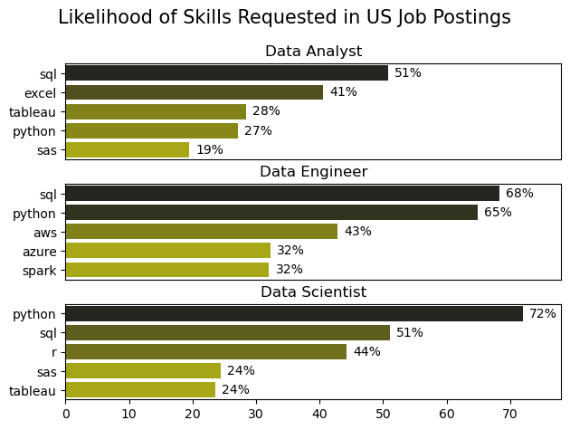
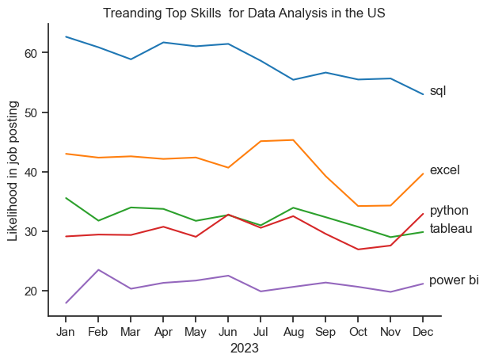
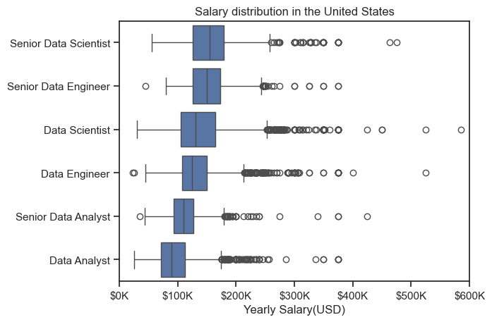

# The Analysis

## 1. What are the most demanded skills for the top three most popular data roles?

To identify the most in-demand skills for the top three data roles, I filtered job postings based on role popularity and extracted the top five skills for each. This analysis highlights the most sought-after job titles and their key skills, providing guidance on which competencies to prioritize depending on the target role. 

View my notebook with detailed steps here:

[2_Skill_Demand.ipynb](3_Project\2_Skills_Demand.ipynb)

### Visualize Data

```python
fig, ax = plt.subplots(len(job_titles), 1)

for i, job_title in enumerate(job_titles):
    df_plot = df_skills_perc[df_skills_perc['job_title_short'] == job_title].head(5)
    sns.barplot(data = df_plot,x='skill_percent',y='job_skills',ax=ax[i],hue= 'skill_count',palette='dark:y_r')
    # little cleanup
    ax[i].set_title(job_title)
    ax[i].set_ylabel('')
    ax[i].set_xlabel('')
    ax[i].get_legend().remove()
    ax[i].set_xlim(0, 78)

    # lets add the percentage of job postings in the bar graph for each bar.
    for n, v in enumerate(df_plot['skill_percent']):
        ax[i].text(v + 1, n, f'{v:.0f}%',va='center')
        # n is index and v is value. 
    if i != len(job_titles) - 1:
        ax[i].set_xticks([])

fig.suptitle('Likelihood of Skills Requested in US Job Postings',fontsize=15)
fig.tight_layout(h_pad=0.5) #fix the overlap
plt.show()
```
### Results



### Insights
- Python is a veratile skill, highly demanded skill across all 3 roles. but most prominently for Data Scientists (72%) and Data Engineers(65%).
- Also , SQL is the most requested skill for the Data Analyst and Data Scientists , with it in over half the job postings for both roles. 

## 2. How are in-demand skills trending for Data Analysts?

### Visualize data
```python
df_plot = df_DA_US_percent.iloc[:, :5]

sns.lineplot(data=df_plot, dashes=False, palette='tab10')
sns.set_theme(style='ticks')
sns.despine()

plt.title('Treanding Top Skills  for Data Analysis in the US')
plt.ylabel('Likelihood in job posting')
plt.xlabel('2023')
plt.legend().remove()

from matplotlib.ticker import PercentFormatter
ax = plt.gca()
ax.yaxis.set_major_formatter(PercentFormatter(decimals=0))

for i in range(5):
    plt.text(11.2, df_plot.iloc[-1,i], df_plot.columns[i])
plt.show()
```

### Results


*Bar graph visualizing the trending top skills for data analysts in the US in 2023.*

### Insights:

- SQL remains the most consistently demanded skill throughout the year, although it shows a gradual decrease in demand.

- Excel experienced a significant increase in demand starting around September, surpassing both Python and Tableau by the end of the year.

- Both Python and Tableau show relatively stable demand throughout the year with some fluctuations but remain essential skills for data analysts. Power BI, while less demanded compared to the others, shows a slight upward trend towards the year's end.

## 3. How well do jobs and skills pay for Data Analysts?

### Salary Analysis for Data Nerds

### Visualize Data

```python
sns.boxplot(data=df_US_top6, x='salary_year_avg', y='job_title_short', order=job_order)
ticks_x = plt. FuncFormatter(lambda y, pos: f'${int (y/1000))K')
plt.gca().xaxis.set_major_formatter(ticks_x)
plt.show()
```

### Results



*Box plot visualizing the salary distributions for the top 6 data job titles.*

### Insights

- Senior Data Scientist positions tend to have the highest salary potential, with up to $600K, indicating the high value placed on advanced data skills and experience in the industry.

- Senior Data Engineer and Senior Data Scientist roles show a considerable number of outliers on the higher end of the salary spectrum, suggesting that exceptional skills or circumstances can lead to high pay in these roles. In contrast, Data Analyst roles demonstrate more consistency in salary, with fewer outliers.

- The median salaries increase with the seniority and specialization of the roles. Senior roles (Senior Data Scientist, Senior Data Engineer) not only have higher median salaries but also larger differences in typical salaries, reflecting greater variance in compensation as responsibilities increase. 


